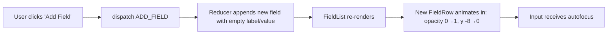
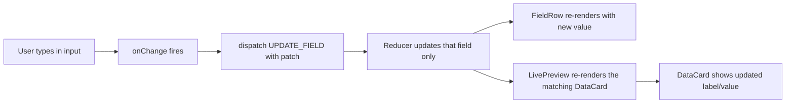
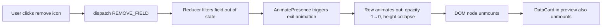
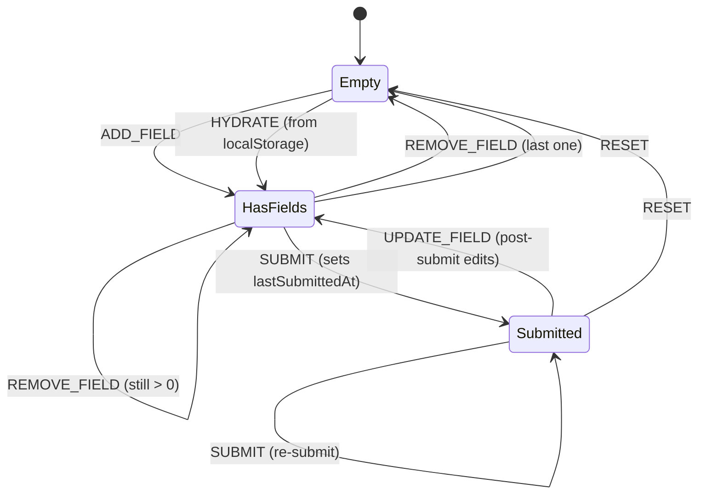

# App Flow Document
## Supremus Angel — Dynamic Form Builder

> User journeys, interaction flows, and state transitions

---

| | |
|---|---|
| **Project** | Supremus Angel — Developer Assessment |
| **Document Version** | 1.0 |
| **Date** | May 26, 2026 |
| **Companion Documents** | [PRD](./Supremus_Angel_PRD.md) · [TRD](./Supremus_Angel_TRD.md) |
| **Audience** | Engineering, Design, QA |

---

## 1. Introduction

This document describes how a user moves through the Dynamic Form Builder — from landing on the page to seeing their data rendered. It covers the happy path, alternate flows, and edge cases.

The app has a single screen. All flows happen on that one screen — there are no routes, no modals, no separate pages.

## 2. Entry Point

There is exactly one entry point:

- **URL:** `/` (the root route)
- **Initial state:** empty form, empty preview, friendly empty-state message.

No login. No splash screen. No onboarding.

```
┌─────────────────────────────────────────────┐
│            Supremus Angel                   │
│        Dynamic Form Builder                 │
├──────────────────────┬──────────────────────┤
│                      │                      │
│   [+ Add Field]      │     ✨ Empty State   │
│                      │                      │
│   No fields yet —    │   "Add a field to    │
│   click Add Field    │    see it rendered   │
│   to begin.          │    here in real      │
│                      │    time."            │
│                      │                      │
└──────────────────────┴──────────────────────┘
       Form Column            Preview Column
```

## 3. Primary Flows

### 3.1 Flow A — Add a Field

**Goal:** User adds a new input field to the form.

**Trigger:** Clicks the **"+ Add Field"** button.



**Steps:**

1. User clicks **+ Add Field**.
2. Reducer dispatches `ADD_FIELD`.
3. A new `FormField` object is created with a unique `nanoid()`, empty `label`, empty `value`, default `type: 'text'`.
4. The new row animates in (220ms ease-out).
5. The new field's **label** input receives autofocus.
6. Live preview shows nothing new yet (label and value are empty).

**Post-condition:** Form has +1 row. Preview is unchanged until the user types.

---

### 3.2 Flow B — Edit a Field (Live Preview)

**Goal:** User types into a field and sees the preview update instantly.

**Trigger:** User types in the label or value input of any `FieldRow`.



**Steps:**

1. User types a character.
2. `FieldRow`'s `onChange` handler fires.
3. `dispatch({ type: 'UPDATE_FIELD', id, patch: { label: 'X' } })`.
4. Reducer returns a new state with only that field updated (immutable update).
5. React re-renders:
   - The edited `FieldRow` (because its `field` prop reference changed).
   - The matching `DataCard` in the preview.
   - All other rows skip re-rendering thanks to `React.memo`.
6. Preview reflects the new value on the same tick — no debounce, no submit.

**Post-condition:** Form and preview are in sync.

---

### 3.3 Flow C — Change Field Type

**Goal:** User switches a field from `text` to `number` (or `email`).

**Trigger:** User selects a new option in the type dropdown.

**Steps:**

1. User opens the type dropdown next to the value input.
2. Selects `number`.
3. `dispatch({ type: 'UPDATE_FIELD', id, patch: { type: 'number' } })`.
4. The input element re-renders as `<input type="number">`.
5. Existing value is preserved if valid; cleared and flagged if not (e.g. text "hello" can't become a number → `error: "Invalid number"`).
6. Preview's `DataCard` updates its formatting (e.g. right-aligns numeric values).

**Post-condition:** Field has new type; validation may have triggered.

---

### 3.4 Flow D — Remove a Field

**Goal:** User deletes a field.

**Trigger:** Clicks the trash icon on a `FieldRow`.



**Steps:**

1. User clicks the remove icon.
2. `dispatch({ type: 'REMOVE_FIELD', id })`.
3. Field is filtered out of state immediately.
4. `AnimatePresence` keeps the DOM node alive long enough to play the exit animation (180ms).
5. Once animation completes, the row unmounts.
6. The matching `DataCard` in the preview also unmounts.
7. Remaining fields shift up to fill the space.

**Edge case:** If this was the last field, both the form column and the preview column return to their empty states.

**Post-condition:** Form has -1 row. Other fields retain their data (FR-4).

---

### 3.5 Flow E — Submit

**Goal:** User commits the current state to the rendered view.

**Trigger:** Clicks **Submit**.

**Steps:**

1. User clicks **Submit**.
2. Validation runs across all fields.
3. **If any field has an error:**
   - Errors are surfaced inline (FR-9).
   - Submit does not block — preview still updates with what's valid.
4. `lastSubmittedAt` is set to `Date.now()` in state.
5. Preview enters its "submitted" visual treatment (subtle border highlight, "Last submitted: 2s ago" timestamp).
6. If ≥ 2 numeric fields exist, `<DataChart />` appears below the cards.

**Post-condition:** Preview shows a committed snapshot. Editing fields after submit continues to update the live preview as before.

---

### 3.6 Flow F — Hover Data Card (Tooltip)

**Goal:** User inspects field metadata.

**Trigger:** Hovers (or focuses via keyboard) on a `DataCard`.

**Steps:**

1. User mouses over a `DataCard`, or tabs to it.
2. After ~50ms, `<Tooltip />` appears (150ms scale + fade in).
3. Tooltip shows: field type, character count (or numeric value), and time since last edit.
4. Tooltip dismisses on mouse leave or blur.

**Accessibility:** Tooltip is announced via `aria-describedby` for screen readers.

---

## 4. Alternate & Edge Case Flows

### 4.1 Empty Label

**Scenario:** User adds a field but never types a label.

- The `DataCard` displays the label as `"Untitled field"` in muted text.
- On submit, validation flags it: `error: "Label is required"`.
- The user can still continue editing — no blocking modal.

### 4.2 Duplicate Labels

**Scenario:** Two fields share the same label.

- This is allowed by design — the source of truth is `id`, not `label`.
- Preview shows both cards; they appear in the order they were added.

### 4.3 Invalid Email / Number

**Scenario:** User types `"abc"` into a field typed as `email`.

- On blur, the validator runs.
- Field shows inline error: `"Invalid email format"`.
- The `DataCard` still renders the raw value, with a small warning indicator on hover.
- Other fields and the rest of the app are unaffected.

### 4.4 Removing the Last Field

**Scenario:** User removes the only field.

- Exit animation plays.
- Preview column transitions to its empty state.
- Form column shows the same "Add a field to begin" prompt as the initial load.

### 4.5 Page Refresh (with localStorage enabled)

**Scenario:** User refreshes the browser after adding fields.

- On mount, `useLocalStorage()` reads saved fields and dispatches `HYDRATE`.
- Form re-populates instantly with the previous session's data.
- If `localStorage` is unavailable (private mode, disabled), the app starts empty silently — no error.

### 4.6 Page Refresh (without persistence)

**Scenario:** Persistence is disabled.

- State resets to empty on every load. This is expected behaviour, not a bug.

### 4.7 Rapid Add (Stress Test)

**Scenario:** User clicks **+ Add Field** rapidly 20+ times.

- Each click dispatches `ADD_FIELD`; reducer handles them serially.
- Animations stagger naturally because each row mounts on its own tick.
- Performance target: no perceptible lag up to ~50 fields.

### 4.8 Reduced Motion Preference

**Scenario:** User's OS has `prefers-reduced-motion: reduce`.

- Framer Motion animations are downgraded to instant transitions.
- No fade, no slide, no scale — just immediate appearance/disappearance.
- All functionality remains intact.

---

## 5. State Transitions

The reducer governs all transitions. Below is the full state machine:



**State labels:**

- **Empty** — `fields.length === 0`
- **HasFields** — `fields.length > 0`, `lastSubmittedAt === null`
- **Submitted** — `fields.length > 0`, `lastSubmittedAt !== null`

---

## 6. Responsive Flow Differences

### 6.1 Desktop (> 1024px)

- Two-column layout: form on the left, preview on the right.
- Both visible simultaneously — no toggle needed.
- Hover states active for tooltips.

### 6.2 Tablet (641–1024px)

- Two-column layout preserved but narrower.
- Touch targets remain ≥ 44px.
- Tooltips trigger on tap-and-hold instead of hover.

### 6.3 Mobile (≤ 640px)

- Layout stacks vertically: form on top, preview below.
- A sticky "Jump to preview" anchor link appears at the top of the form on mobile (optional polish).
- All buttons sized for thumb tapping.
- Tooltips trigger on tap; dismiss on tap-outside.

```
DESKTOP (≥1025px)            MOBILE (≤640px)
┌──────────┬──────────┐      ┌──────────────┐
│  FORM    │ PREVIEW  │      │    FORM      │
│          │          │      │              │
│  Field 1 │  Card 1  │      │  Field 1     │
│  Field 2 │  Card 2  │      │  Field 2     │
│  [+Add]  │  Chart   │      │  [+Add]      │
│          │          │      ├──────────────┤
└──────────┴──────────┘      │   PREVIEW    │
                             │              │
                             │  Card 1      │
                             │  Card 2      │
                             │  Chart       │
                             └──────────────┘
```

---

## 7. Full User Journey Example

A representative end-to-end walkthrough:

| Step | User Action | App Response |
|---|---|---|
| 1 | Lands on `/` | Sees empty form, empty preview, prompt to add a field. |
| 2 | Clicks **+ Add Field** | New row animates in, label input focused. |
| 3 | Types `"Name"` in label | Preview card title updates live to "Name". |
| 4 | Types `"Aarav"` in value | Card body updates to "Aarav" live. |
| 5 | Clicks **+ Add Field** again | Second row animates in below the first. |
| 6 | Changes second field type to `number` | Input becomes numeric. |
| 7 | Types `"42"` in second value | Second card shows "42", right-aligned. |
| 8 | Hovers on first card | Tooltip appears: "Type: text · 5 chars · Edited 12s ago". |
| 9 | Clicks **Submit** | `lastSubmittedAt` set; cards get subtle highlight. |
| 10 | Adds a third numeric field with value `100` | A `<DataChart />` appears below the cards (now 2 numeric fields). |
| 11 | Removes the first field | Card animates out; chart re-renders with only the numeric data. |
| 12 | Resizes browser to mobile width | Layout reflows to stacked; preview moves below form. |

---

## 8. Out of Flow

These actions are explicitly **not** part of the app flow:

- Login / signup / authentication.
- Multi-step wizards or modals.
- Server submission or API calls.
- Sharing or exporting data.
- Real-time collaboration with other users.

If any of these come up in QA, they are bugs in scope interpretation, not missing features.

---

*End of Document*
